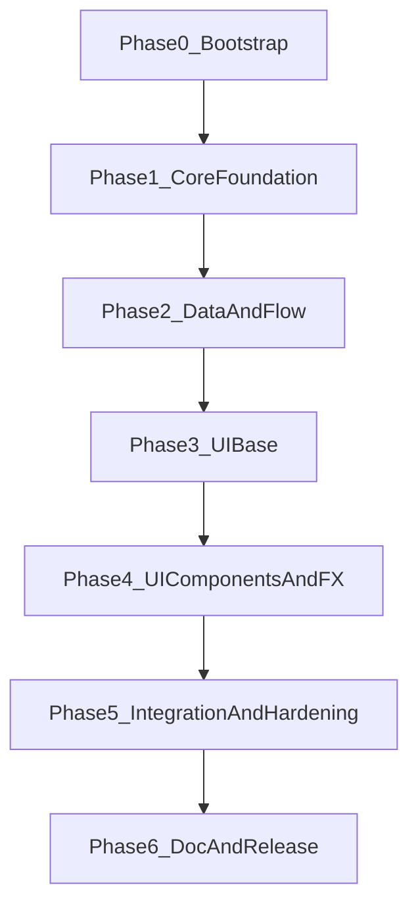

# Kế hoạch triển khai Unity Template cho team 8 người

## 1) Mục tiêu và nguyên tắc triển khai

- Bám kiến trúc package hiện tại tại `[d:/GameUp/gameup-unity-template/doc/unity_core_framework_plan_5cdcb640.plan.md](d:/GameUp/gameup-unity-template/doc/unity_core_framework_plan_5cdcb640.plan.md)` và README `[d:/GameUp/gameup-unity-template/README.md](d:/GameUp/gameup-unity-template/README.md)`.
- Giữ Core độc lập, UI phụ thuộc Core, Extensions tách rời để tái sử dụng.
- Dự án đã có DOTween: dùng DOTween cho animation UI (Transition, ItemMoveHelper, Notify/Toast animation), nhưng interface transition vẫn giữ abstraction để không khóa framework.
- Definition of Done bắt buộc cho mọi task:
  - Dev tự test lại chức năng + smoke test các luồng liên quan.
  - Dev tự viết/ cập nhật tài liệu sử dụng ngắn gọn (API usage + prefab setup nếu có).
  - Dev ping lead để review code + review tài liệu trước khi merge.

## 2) Cách thức tiếp cận dự án (team workflow)

- Mô hình nhánh:
  - `main`: luôn xanh (build/test pass).
  - `develop` (khuyến nghị): tích hợp theo phase.
  - `feature/<module>-<owner>`: từng module/tính năng.
- Quy trình mỗi task:
  - Nhận ticket -> làm trên nhánh feature -> self-test -> cập nhật docs -> tạo PR -> ping lead review.
  - Chỉ merge khi pass checklist DoD và không phá asmdef dependency.
- Cadence phối hợp:
  - Daily sync ngắn theo blocker.
  - Cuối mỗi phase có integration checkpoint (merge + test hồi quy).
- Quy chuẩn code:
  - Public API có XML docs.
  - Có sample usage tối thiểu cho module mới.
  - Không thêm coupling chéo trái kiến trúc (UI không bị gọi ngược bởi Core runtime).

## 3) Cấu trúc team 8 người

- Lead (1 người): kiến trúc, review cuối, quản lý dependency, quyết định tiêu chuẩn API.
- 7 Dev chia vai trò:
  - Dev A: Core Foundations (Singleton, CoroutineRunner, TimeSystem)
  - Dev B: EventBus + SceneLoader
  - Dev C: SaveLoad + GameUtils
  - Dev D: ObjectPool
  - Dev E: Audio
  - Dev F: UI Manager/Navigation
  - Dev G: UI Components/Transition + ItemMoveHelper
- Quy tắc ownership:
  - Mỗi module có 1 owner chính và 1 backup reviewer chéo.
  - Task giao nhau phải chốt contract trước (interface, event payload, lifecycle).

## 4) Cấu trúc folder đề xuất triển khai

Giữ theo plan hiện tại, bổ sung rõ khu vực UI components mở rộng:

- `[d:/GameUp/gameup-unity-template/Assets/GameUpCore/Runtime/Core/](d:/GameUp/gameup-unity-template/Assets/GameUpCore/Runtime/Core/)`
  - `Singleton/`, `EventBus/`, `TimeSystem/`, `SceneLoader/`, `SaveLoad/`, `ObjectPool/`, `CoroutineRunner/`, `Audio/`
- `[d:/GameUp/gameup-unity-template/Assets/GameUpCore/Runtime/UI/](d:/GameUp/gameup-unity-template/Assets/GameUpCore/Runtime/UI/)`
  - `Manager/`, `Navigation/`, `Transition/`, `Components/`
  - Trong `Components/` bổ sung theo nhu cầu: `NotifyBar/`, `Toast/`, `SelectView/`, `Buttons/`, `Helpers/ItemMoveHelper.cs`
- `[d:/GameUp/gameup-unity-template/Assets/Extensions/](d:/GameUp/gameup-unity-template/Assets/Extensions/)`
  - `StringUtils`/`GameExtension`/`GameUtils` và extension độc lập
- `[d:/GameUp/gameup-unity-template/Assets/GameUpCore/Tests/](d:/GameUp/gameup-unity-template/Assets/GameUpCore/Tests/)`
  - Runtime tests theo module
- `[d:/GameUp/gameup-unity-template/Assets/GameUpCore/Samples~/](d:/GameUp/gameup-unity-template/Assets/GameUpCore/Samples~/)`
  - Scene demo tích hợp Core + UI

## 5) Checklist triển khai theo module

### Core

- Singleton
- EventBus
- TimeSystem
- SceneLoader
- SaveLoad
- ObjectPool
- CoroutineRunner
- Audio
- GameExtension
- StringUtils
- GameUtils

### UI

- UI Manager
- Multi resolution / đa màn hình (CanvasScaler + safe area + anchor policy)
- Popup
- Navigation
- Transition (ưu tiên DOTween adapter)
- Components base
- NotifyBar
- Toast
- SelectView
- Button
- CustomSelectButton
- CustomSelectViews
- ItemMoveHelper (hiệu ứng tiền bay)

### Chất lượng & tài liệu

- Unit test/smoke test cho module trọng yếu
- Demo scene tích hợp
- README module/API usage
- Checklist review + merge gate

## 6) Tiến trình triển khai (không gắn số ngày)

- Phase0_Bootstrap:
  - Chốt coding convention, git flow, PR template, DoD, owner từng module.
  - Khóa kiến trúc asmdef/dependency.
- Phase1_CoreFoundation (làm trước):
  - Singleton, CoroutineRunner, TimeSystem, GameExtension/StringUtils/GameUtils.
  - Mục tiêu: tạo nền API dùng chung cho các module sau.
- Phase2_DataAndFlow:
  - EventBus, SaveLoad, SceneLoader, ObjectPool, Audio.
  - Mục tiêu: hoàn thành các dịch vụ runtime cốt lõi.
- Phase3_UIBase:
  - UI Manager, Navigation, Popup, Multi resolution.
  - Mục tiêu: khung UI ổn định, điều hướng chuẩn.
- Phase4_UIComponentsAndFX:
  - Transition (DOTween), NotifyBar, Toast, SelectView, Button, CustomSelectButton, CustomSelectViews, ItemMoveHelper.
  - Mục tiêu: hoàn thiện lớp reusable UI components và hiệu ứng.
- Phase5_IntegrationAndHardening:
  - Tích hợp toàn hệ thống vào sample scene.
  - Test hồi quy chéo module, xử lý race/lifecycle/null-safe.
- Phase6_DocAndRelease:
  - Hoàn thiện docs sử dụng theo module, onboarding notes.
  - Chốt release checklist, tag phiên bản nội bộ.

## 7) Cơ chế kiểm soát chất lượng bắt buộc cho từng dev

Mỗi dev khi hoàn thành task phải thực hiện đủ 3 bước trước khi yêu cầu merge:

- Tự test:
  - Test happy path + edge cases chính.
  - Verify không phá scene/sample hiện có.
- Tự viết docs:
  - Cập nhật hướng dẫn sử dụng module vừa làm (init, API chính, ví dụ gọi).
- Ping lead review:
  - Gửi PR + checklist self-test + link docs cập nhật.
  - Chỉ merge sau khi lead approve.

## 8) Ma trận triển khai song song (để tối ưu team 7 dev + 1 lead)

- Luồng song song 1 (Core nền): Dev A + Dev C
- Luồng song song 2 (Flow services): Dev B + Dev D + Dev E
- Luồng song song 3 (UI): Dev F + Dev G
- Lead:
  - Review theo thứ tự dependency: Foundation -> Services -> UI Base -> UI Components.
  - Chặn merge nếu thiếu self-test hoặc thiếu doc usage.

## 9) Deliverables cuối mỗi phase

- Code đã merge theo module owner.
- Checklist self-test của từng task.
- Tài liệu sử dụng cập nhật tương ứng.
- Demo scene chạy ổn ở mức tích hợp phase.

