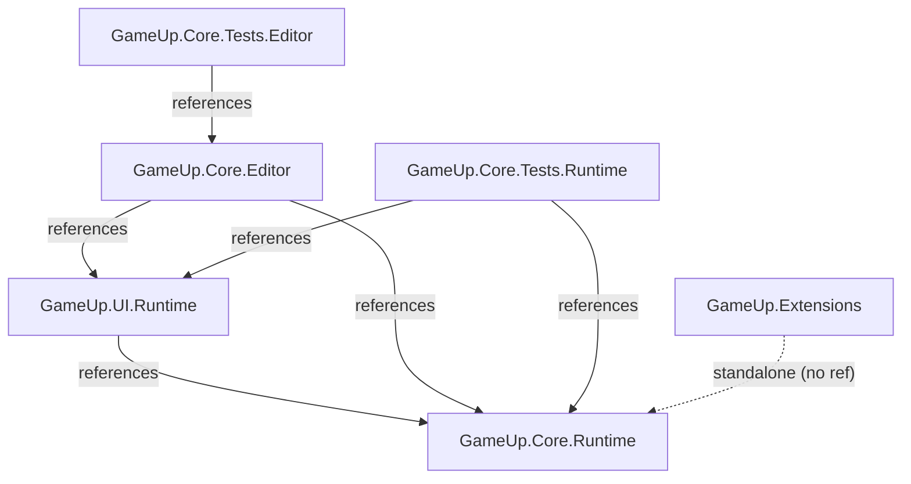

# Kế hoạch phát triển Core Framework Unity (7 ngày)

## Tổng quan

**Tên:** Unity Core Framework Plan  
**Mô tả:** Kế hoạch phát triển 7 ngày cho bộ Framework/Core Codebase Unity, triển khai theo Cách 2 (package nằm trong Assets/ của Unity project), bao gồm Core Systems, UI Framework, và Extensions/GameUtils.

---

## Thông tin dự án hiện tại

- **Unity:** 2022.3.62f3, URP 2D Template
- **Trạng thái:** Project sạch, chưa có script/asmdef/package.json nào
- **Repo:** `D:\GameUp\gameup-unity-template` (git, branch main)
- **Triển khai:** Cách 2 -- package nằm trong `Assets/` của Unity project

---

## 1. Kiến trúc thư mục (Folder Structure)

Package gốc: `Assets/GameUpCore/`

```
Assets/
├── GameUpCore/                              ← Package root
│   ├── package.json                         ← com.gameup.core, version 0.1.0
│   ├── README.md
│   ├── CHANGELOG.md
│   │
│   ├── Runtime/
│   │   ├── Core/
│   │   │   ├── GameUp.Core.Runtime.asmdef   ← Assembly gốc, không ref ngoài
│   │   │   ├── Singleton/
│   │   │   │   ├── Singleton.cs             ← Generic Singleton<T>
│   │   │   │   └── PersistentSingleton.cs   ← DontDestroyOnLoad variant
│   │   │   ├── EventBus/
│   │   │   │   ├── IEvent.cs                ← Interface marker
│   │   │   │   ├── EventBus.cs              ← Static generic EventBus<T>
│   │   │   │   └── EventBinding.cs          ← Subscription handle
│   │   │   ├── FSM/
│   │   │   │   ├── IState.cs                ← Enter/Update/Exit
│   │   │   │   ├── StateMachine.cs          ← Dictionary<Type, IState>
│   │   │   │   └── BaseState.cs             ← Abstract convenience class
│   │   │   ├── ObjectPool/
│   │   │   │   ├── IPoolable.cs
│   │   │   │   ├── ObjectPool.cs            ← Generic pool
│   │   │   │   └── MonoPool.cs              ← MonoBehaviour pool (prefab)
│   │   │   ├── SaveLoad/
│   │   │   │   ├── ISaveSystem.cs
│   │   │   │   ├── JsonSaveSystem.cs
│   │   │   │   └── BinarySaveSystem.cs
│   │   │   ├── Audio/
│   │   │   │   ├── AudioManager.cs          ← Singleton, BGM/SFX
│   │   │   │   ├── AudioData.cs             ← ScriptableObject config
│   │   │   │   └── SFXPool.cs               ← Pool-based SFX
│   │   │   ├── Config/
│   │   │   │   ├── ConfigLoader.cs          ← SO + JSON loader
│   │   │   │   └── GameConfig.cs            ← Base SO config
│   │   │   ├── SceneLoader/
│   │   │   │   ├── SceneLoader.cs           ← Async + progress callback
│   │   │   │   └── SceneTransition.cs       ← Loading screen logic
│   │   │   ├── CoroutineRunner/
│   │   │   │   └── CoroutineRunner.cs       ← Global MonoBehaviour runner
│   │   │   ├── Logger/
│   │   │   │   ├── GLogger.cs               ← Tagged logger, conditional compile
│   │   │   │   └── LogConfig.cs             ← SO cấu hình log level
│   │   │   └── TimeSystem/
│   │   │       ├── TimeManager.cs           ← Custom time scale, pause
│   │   │       └── Timer.cs                 ← Countdown/Stopwatch utility
│   │   │
│   │   └── UI/
│   │       ├── GameUp.UI.Runtime.asmdef     ← Ref: GameUp.Core.Runtime
│   │       ├── Manager/
│   │       │   ├── UIManager.cs             ← Root canvas, layer management
│   │       │   ├── UIScreen.cs              ← Base class cho screen
│   │       │   ├── UIPopup.cs               ← Base class cho popup
│   │       │   └── UILayer.cs               ← Enum/config layer order
│   │       ├── Navigation/
│   │       │   ├── ScreenNavigator.cs       ← Stack-based screen flow
│   │       │   └── PopupStack.cs            ← LIFO popup management
│   │       ├── Transition/
│   │       │   ├── ITransition.cs           ← Interface
│   │       │   ├── FadeTransition.cs
│   │       │   ├── SlideTransition.cs
│   │       │   └── ScaleTransition.cs
│   │       └── Components/
│   │           ├── SafeButton.cs            ← Anti double-click
│   │           ├── LoadingScreen.cs
│   │           ├── Toast.cs
│   │           ├── Dialog.cs                ← Confirm/Cancel dialog
│   │           └── BannerNotification.cs
│   │
│   ├── Editor/
│   │   ├── GameUp.Core.Editor.asmdef        ← Ref: Core + UI, Platform: Editor
│   │   ├── AudioDataEditor.cs               ← Custom inspector cho AudioData
│   │   └── LogConfigEditor.cs
│   │
│   ├── Tests/
│   │   ├── Runtime/
│   │   │   ├── GameUp.Core.Tests.Runtime.asmdef
│   │   │   ├── EventBusTests.cs
│   │   │   ├── ObjectPoolTests.cs
│   │   │   ├── SaveLoadTests.cs
│   │   │   └── FSMTests.cs
│   │   └── Editor/
│   │       └── GameUp.Core.Tests.Editor.asmdef
│   │
│   └── Samples~/
│       ├── CoreDemo/
│       │   └── CoreDemoScene.unity
│       └── UIDemo/
│           ├── UIDemoScene.unity
│           └── Prefabs/
│
├── Extensions/
│   ├── GameUp.Extensions.asmdef             ← Standalone, no ref
│   ├── TransformExtensions.cs
│   ├── VectorExtensions.cs
│   ├── ListExtensions.cs
│   ├── StringExtensions.cs
│   ├── ColorExtensions.cs
│   └── GameUtils.cs                         ← Math, random, game logic helpers
│
├── Scenes/
│   └── SampleScene.unity                    ← Existing
└── Settings/                                ← Existing URP settings
```

### Assembly Definitions (asmdef) -- Dependency Graph




- `GameUp.Extensions` de-coupled, dung duoc doc lap hoac cung Core.
- `Extensions/` nam ngoai `GameUpCore/` de dung chung cho ca project, khong chi package.

---

## 2. Timeline chi tiet (7 ngay)

### Ngay 1: Project Setup + Core Foundations

**Sang (4h):**

- Tao cau truc thu muc `Assets/GameUpCore/` day du
- Tao `package.json` (com.gameup.core, v0.1.0)
- Tao 5 file `.asmdef` (Core.Runtime, UI.Runtime, Core.Editor, Tests.Runtime, Tests.Editor)
- Tao `Assets/Extensions/GameUp.Extensions.asmdef`
- Implement `Singleton<T>` va `PersistentSingleton<T>`
- Implement `CoroutineRunner` (global auto-create)

**Chieu (4h):**

- Implement `GLogger` (tagged, conditional compile, log levels)
- Implement `LogConfig` (ScriptableObject)
- Implement `TimeManager` + `Timer`
- Viet unit test co ban cho Singleton

**Technical notes:**

- Singleton: dung generic `Singleton<T> where T : MonoBehaviour`, lazy init `FindObjectOfType` + auto-create GameObject, `DontDestroyOnLoad` variant rieng
- Logger: dung `[System.Diagnostics.Conditional("ENABLE_LOG")]` de strip khoi release build, tag-based filtering
- TimeManager: custom `deltaTime` doc lap `Time.timeScale`, cho phep pause tung layer (game, UI, effect)

---

### Ngay 2: EventBus + FSM + Extensions

**Sang (4h):**

- Implement `IEvent` marker interface
- Implement `EventBus<T>` (static generic class, `Action<T>` subscriptions)
- Implement `EventBinding` (subscription handle, auto-unsubscribe)
- Viet `EventBusTests.cs`

**Chieu (4h):**

- Implement `IState` (Enter/Update/Exit/FixedUpdate)
- Implement `StateMachine` (Dictionary-based state lookup, current state tracking)
- Implement `BaseState` (abstract convenience)
- Implement toan bo Extensions: Transform, Vector, List, String, Color
- Implement `GameUtils` (math helpers, weighted random, distance checks)
- Viet `FSMTests.cs`

**Technical notes:**

- EventBus: dung `static class EventBus<T> where T : IEvent` -- moi event type co rieng 1 list subscribers, O(1) lookup by type. Tra ve `EventBinding` de caller co the Dispose/unsubscribe.
- FSM: Dictionary`<Type, IState>` de transition bang `ChangeState<T>()`. Khong dung enum de de mo rong. Goi `OnExit` -> `OnEnter` tu dong.
- Extensions: pure static methods, khong state, khong allocation.

---

### Ngay 3: Object Pool + Config Loader + Save/Load

**Sang (4h):**

- Implement `IPoolable` (OnSpawn/OnDespawn)
- Implement `ObjectPool<T>` (generic, pre-warm, auto-expand)
- Implement `MonoPool` (prefab-based, parent transform management)
- Viet `ObjectPoolTests.cs`

**Chieu (4h):**

- Implement `GameConfig` (base ScriptableObject)
- Implement `ConfigLoader` (load SO tu Resources, parse JSON)
- Implement `ISaveSystem`, `JsonSaveSystem`, `BinarySaveSystem`
- Viet `SaveLoadTests.cs`

**Technical notes:**

- ObjectPool: `Queue<T>` internal, `Get()` / `Release()` API. MonoPool dung `Stack<GameObject>`, set parent khi return pool, `SetActive(false)`.
- Save/Load: JsonSaveSystem dung `JsonUtility` (hoac Newtonsoft neu da co). BinarySaveSystem dung `BinaryFormatter` hoac `MemoryStream` + custom serialize. Luu vao `Application.persistentDataPath`.
- ConfigLoader: `Resources.Load<ScriptableObject>` cho SO, `TextAsset` + `JsonUtility.FromJson` cho JSON.

---

### Ngay 4: Audio Manager + Scene Loader

**Sang (4h):**

- Implement `AudioData` (ScriptableObject: list clips, volume, loop settings)
- Implement `AudioManager` (Singleton, BGM player voi cross-fade, SFX one-shot)
- Implement `SFXPool` (pool cac AudioSource de play nhieu SFX dong thoi)

**Chieu (4h):**

- Implement `SceneLoader` (async `SceneManager.LoadSceneAsync`, progress callback `Action<float>`)
- Implement `SceneTransition` (loading screen logic, min display time)
- Viet sample: test Audio + Scene loading trong `Samples~/CoreDemo/`
- Implement `AudioDataEditor` (custom inspector)

**Technical notes:**

- AudioManager: 2 AudioSource cho BGM (cross-fade lerp giua source A va B). SFX dung pool 5-10 AudioSource, `PlayOneShot` hoac `Play()` roi auto-return.
- SceneLoader: `AsyncOperation.allowSceneActivation = false` de cho loading screen hien du, set `true` khi progress >= 0.9f va UI san sang.
- Cross-fade: Coroutine lerp volume source A (1->0) va source B (0->1) trong 1-2s.

---

### Ngay 5: UI Framework Core

**Sang (4h):**

- Implement `UILayer` (enum: Background, Screen, Popup, Overlay, Toast)
- Implement `UIScreen` (base MonoBehaviour: Show/Hide/OnShow/OnHide virtual)
- Implement `UIPopup` (base: Show/Hide, overlay background click-to-close option)
- Implement `UIManager` (Singleton, root Canvas management, layer sorting)

**Chieu (4h):**

- Implement `ScreenNavigator` (stack-based: Push/Pop screen, history)
- Implement `PopupStack` (LIFO: ShowPopup/DismissPopup/DismissAll, overlay management)
- Implement `SafeButton` (cooldown 0.3-0.5s chong double-click)
- Tao prefab mau: 1 screen, 1 popup

**Technical notes:**

- UIManager: tao root Canvas (ScreenSpace-Overlay hoac Camera), moi layer la 1 Transform child co `sortingOrder` khac nhau. `Dictionary<Type, UIScreen>` va `Dictionary<Type, UIPopup>` de lookup.
- ScreenNavigator: `Stack<UIScreen>`, Push an screen cu (SetActive false) hien screen moi, Pop nguoc lai. Co event `OnScreenChanged`.
- PopupStack: `Stack<UIPopup>`, moi popup co 1 overlay (Image raycast target), popup moi nhat o tren cung. DismissAll pop het stack.

---

### Ngay 6: UI Components + Transitions

**Sang (4h):**

- Implement `ITransition` (interface: `Play(RectTransform, Action onComplete)`)
- Implement `FadeTransition` (CanvasGroup alpha 0->1 / 1->0)
- Implement `SlideTransition` (anchoredPosition lerp tu ngoai man hinh vao)
- Implement `ScaleTransition` (localScale 0->1 bounce)
- Tich hop Transition vao `UIScreen.Show/Hide` va `UIPopup.Show/Hide`

**Chieu (4h):**

- Implement `LoadingScreen` (progress bar, text %, singleton access)
- Implement `Toast` (auto-hide sau N giay, queue nhieu toast)
- Implement `Dialog` (title, message, confirm/cancel buttons, callback)
- Implement `BannerNotification` (slide tu tren xuong, auto-hide)
- Tao prefab cho tat ca components

**Technical notes:**

- Transitions: dung `Coroutine` + `AnimationCurve` (khong bat buoc DOTween). Neu project co DOTween thi co the dung, nhung core framework nen self-contained.
- Toast: Queue`<ToastData>`, hien 1 toast, khi an thi dequeue tiep. Position: bottom-center.
- Dialog: prefab co 2 layout (1 button / 2 button), callback `Action<bool>`.
- BannerNotification: slide anchoredPosition.y tu ngoai vao, auto-hide sau 3s.

---

### Ngay 7: Integration + Samples + Documentation + Polish

**Sang (4h):**

- Tao `Samples~/CoreDemo/CoreDemoScene.unity`: test EventBus, Pool, Audio, Save/Load, FSM
- Tao `Samples~/UIDemo/UIDemoScene.unity`: test screen navigation, popup, toast, dialog, loading
- Chay toan bo unit tests, fix neu co loi
- Kiem tra assembly references dung, khong loi compile

**Chieu (4h):**

- Hoan thien `README.md` (cai dat, API overview, code snippets)
- Hoan thien `CHANGELOG.md`
- Tao `CONTRIBUTING.md` (coding convention, branch strategy, MR flow)
- Review code, cleanup, dat XML docs cho public API
- Tag version `v0.1.0`
- Test: tao 1 project moi, add package qua Git URL `?path=Assets/GameUpCore` de xac nhan UPM hoat dong

---

## 3. Technical Guide (tom tat pattern moi module)


| Module           | Pattern / Approach                                                            | Luu y                                                                        |
| ---------------- | ----------------------------------------------------------------------------- | ---------------------------------------------------------------------------- |
| Singleton        | Generic `Singleton<T> : MonoBehaviour`, lazy `FindObjectOfType` + auto-create | PersistentSingleton variant dung `DontDestroyOnLoad`                         |
| EventBus         | Static generic `EventBus<T> where T : IEvent`, `Action<T>` list               | Tra ve `EventBinding` (IDisposable) de unsubscribe. Khong dung string-based. |
| FSM              | `Dictionary<Type, IState>`, `ChangeState<T>()`                                | Khong dung enum, mo rong bang class moi. Auto call Exit/Enter.               |
| Object Pool      | `Queue<T>` (generic), `Stack<GameObject>` (Mono)                              | Pre-warm option, auto-expand, `IPoolable` callback.                          |
| Save/Load        | Strategy pattern (`ISaveSystem`), Json + Binary impl                          | Path: `Application.persistentDataPath`. JsonUtility cho don gian.            |
| Audio            | Singleton, 2 AudioSource cross-fade BGM, pool SFX                             | `AudioData` SO chua clip list. SFX pool 8 sources.                           |
| Config           | `ScriptableObject` base + JSON fallback                                       | `Resources.Load` cho SO, `TextAsset` parse cho JSON.                         |
| Scene Loader     | `SceneManager.LoadSceneAsync`, progress callback                              | `allowSceneActivation = false` cho loading screen. Min display time.         |
| Coroutine Runner | Auto-create `DontDestroyOnLoad` MonoBehaviour                                 | Static API: `CoroutineRunner.Run()`, `CoroutineRunner.Stop()`.               |
| Logger           | `[Conditional]` attribute, tag + level filtering                              | Strip tu release build. SO config cho log level.                             |
| Time System      | Custom deltaTime, per-layer pause                                             | Doc lap voi `Time.timeScale`. Timer utility (countdown/stopwatch).           |
| UI Manager       | Root Canvas, layer-based sorting, Dictionary lookup                           | Enum UILayer: Background, Screen, Popup, Overlay, Toast.                     |
| Screen Nav       | `Stack<UIScreen>`, Push/Pop                                                   | History tracking, event `OnScreenChanged`.                                   |
| Popup Stack      | `Stack<UIPopup>`, LIFO                                                        | Overlay auto-create, DismissAll support.                                     |
| Transitions      | `ITransition` + Coroutine + AnimationCurve                                    | Self-contained (khong can DOTween). Fade/Slide/Scale.                        |
| Components       | SafeButton, Loading, Toast, Dialog, Banner                                    | Toast: queue-based. Dialog: callback `Action<bool>`.                         |
| Extensions       | Static extension methods                                                      | Pure, no allocation, no state.                                               |


---

## 4. Luu y tong the

- **Khong phu thuoc DOTween/UniTask** trong core: framework tu chu, dung Coroutine + AnimationCurve. Neu project co DOTween thi tao optional adapter sau.
- **Assembly Definition** dam bao compile time nhanh va package co the tach rieng.
- `Extensions/` dat **ngoai** `GameUpCore/` de dung chung cho ca project (khong chi package).
- Dung `#if UNITY_EDITOR` hoac asmdef platform restriction cho Editor code.
- Public API phai co XML docs (`///` comment) de hien tooltip trong IDE va Inspector.

